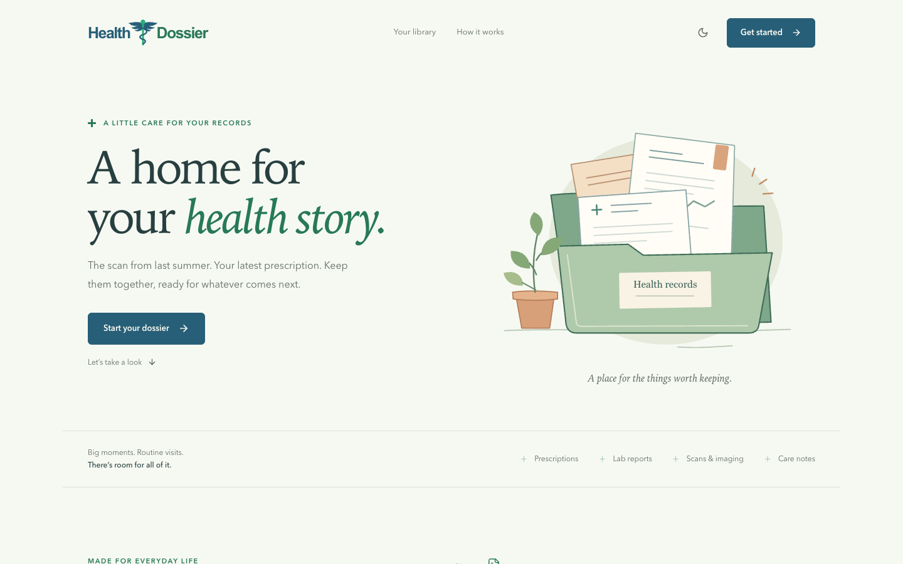
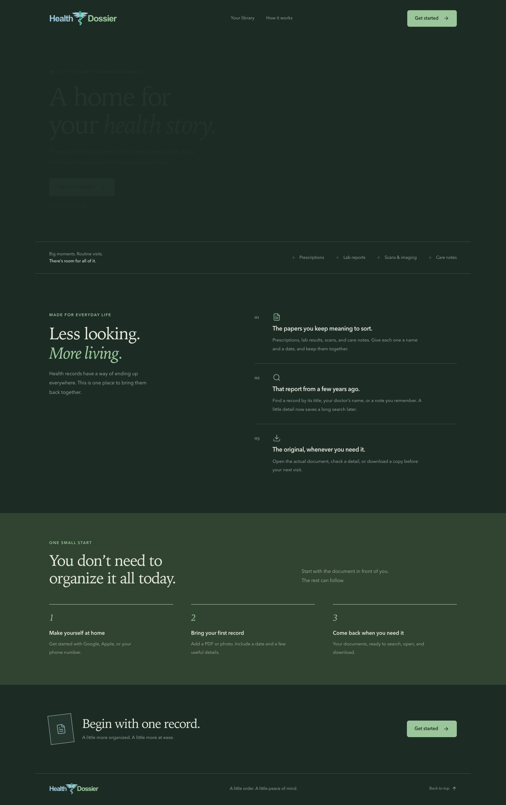
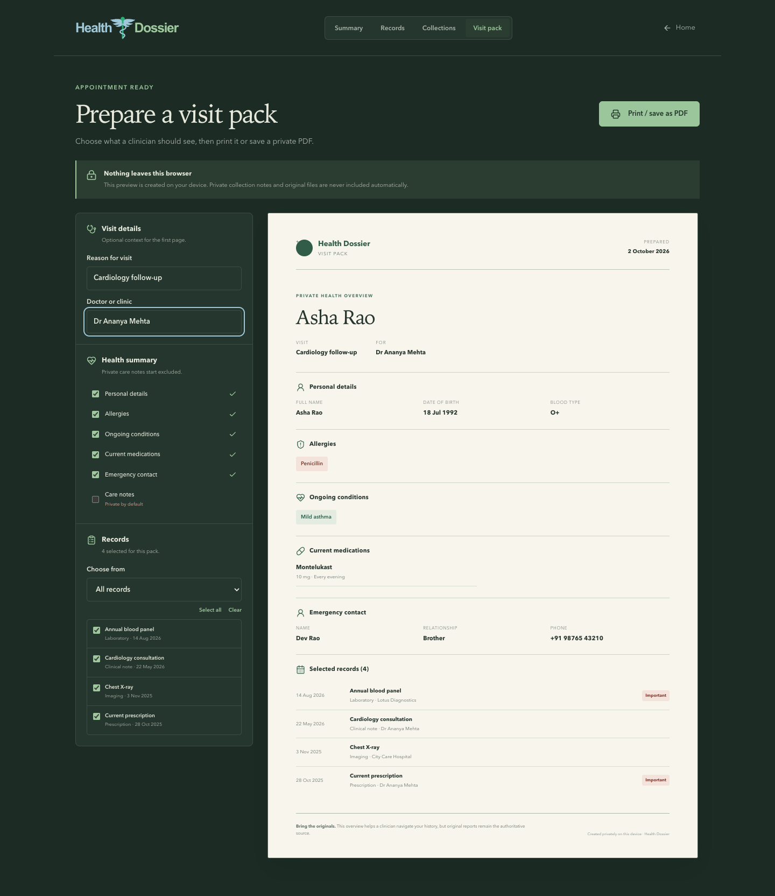
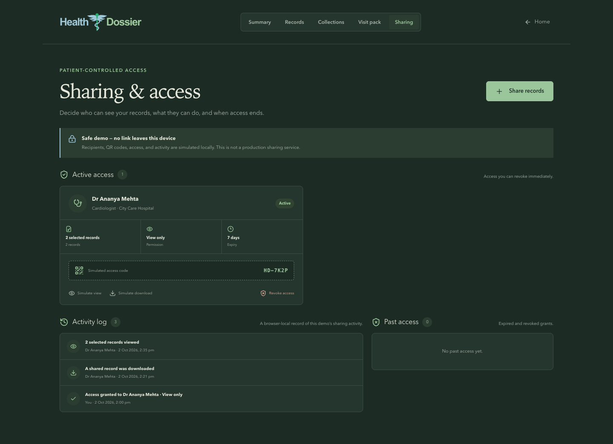
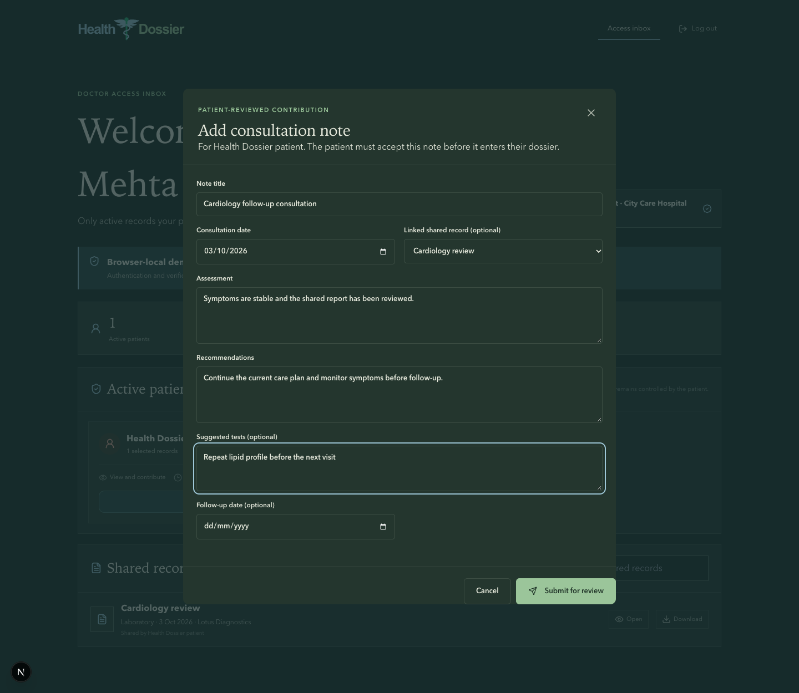
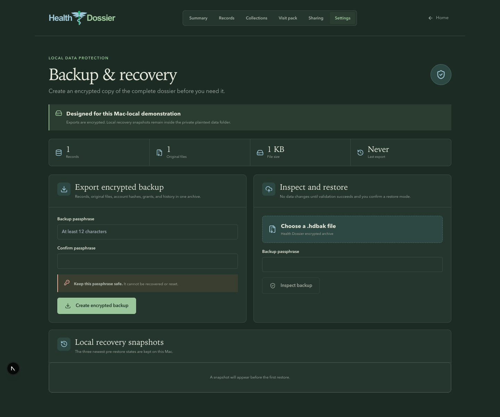

<div align="center">
  <h1>Health Dossier</h1>
  <p><strong>A home for your health story.</strong></p>
  <p>Keep medical documents together, find the one you need, and always have the original close at hand.</p>
</div>



<details>
  <summary>View the complete landing page</summary>
  <br />
  
</details>

## Prepare for an appointment

Build a private, clinician-friendly visit pack from the health summary and selected records. Every section can be reviewed before printing, and care notes stay excluded unless they are deliberately added.



## Control doctor access

Grant a verified demo doctor access to selected records, choose what they can do, set an expiry, and revoke access immediately. Sensitive records stay excluded until they are deliberately reviewed and selected.



## Doctor access inbox

Doctors can create a Mac-local, demo-verified professional profile or sign in with a seeded demo account. Their inbox contains only active records that a patient explicitly shared with that doctor. A “View and contribute” grant also lets the doctor submit a structured consultation note for patient review.



## Protect and restore the dossier

Create a password-protected `.hdbak` archive from Settings. Every referenced original file, record, doctor contribution, credential hash, grant, and audit event is encrypted together. Restore can safely merge missing items or replace the complete dossier after a validated preview, and each restore creates a local recovery snapshot first.



## What you can do

- Add PDF, JPG, PNG, or WebP records up to 25 MB each.
- Review simulated smart-import suggestions beside the original document before anything is saved.
- Save a title, date, record type, provider, specialty, tags, medicines, notable values, and notes alongside the original file.
- See which suggested details were corrected during the required review step.
- Search and filter your library, then preview or download a document.
- Edit record details or remove a record when you no longer need it.
- Keep a health summary with medications, allergies, conditions, blood type, emergency contact, and care notes.
- Browse records as a searchable library or a year-by-year health timeline.
- Group related records into care collections with private notes and their own timelines.
- Prepare a visit pack with selected records, medications, allergies, conditions, and emergency details.
- Print the pack or save it as a PDF without uploading health information.
- Grant simulated, time-limited doctor access with explicit permissions and immediate revocation.
- Mark sensitive records, review sharing activity, and keep those controls stored locally.
- Create a demo-verified doctor profile with locally hashed credentials.
- Sign in to a protected doctor inbox and review only active, patient-granted records.
- Submit an immutable consultation note only when an active grant includes contribution permission.
- Accept or reject doctor notes before they enter the patient dossier.
- See accepted doctor notes in the health timeline and optionally include them in a Visit Pack.
- Export the complete dossier as an authenticated AES-256-GCM encrypted archive.
- Inspect, merge, replace, and roll back backups without exposing raw passwords or active sessions.
- Use the dark theme on desktop and mobile.

## Run locally

Use Node.js 20 or newer:

```bash
npm ci
npm run dev
```

Open **http://127.0.0.1:3000** and select **Get started**.

## How this version stores records

The Next.js server listens only on `127.0.0.1`. By default, structured data is stored as readable JSON in `data/database.json`, original documents are stored in `data/uploads/`, and the previous valid database write is retained as `data/database.json.bak`. Runtime data is ignored by Git and never sent to a cloud service. Set `HEALTH_DOSSIER_DATA_DIR` in an ignored `.env.local` file to keep private runtime data in another local folder, such as `sensi/`.

Patient and doctor access use HTTP-only local cookies. Doctor passwords are stored as salted PBKDF2 hashes, but this remains a local demonstration—not production authentication, authoritative medical-license verification, or a regulated clinical-note system. Anyone who can read files from this macOS account can read the plaintext health data. Back up the complete `data/` directory together.

Encrypted exports require a passphrase of at least 12 characters. Health Dossier cannot recover a forgotten passphrase. Restore validates the archive and every original-file checksum before changing local data. Merge keeps current items when IDs conflict; Replace makes the archive authoritative. The three newest pre-restore snapshots remain locally in `data/restore-snapshots/` and are not separately encrypted.

If the previous browser-only version contains records, the Records page offers a one-time migration. It copies IndexedDB data and files into the local backend while preserving the browser copy as a backup.

## Checks

```bash
npm run lint
npm run build
npm run test:e2e
```

The browser tests use an installed Google Chrome.

For an overview of the routes, components, local storage, and code conventions, see [the code guide](docs/CODE_GUIDE.md).

## Built with

Next.js, React, TypeScript, CSS, JSON, and the local filesystem.
